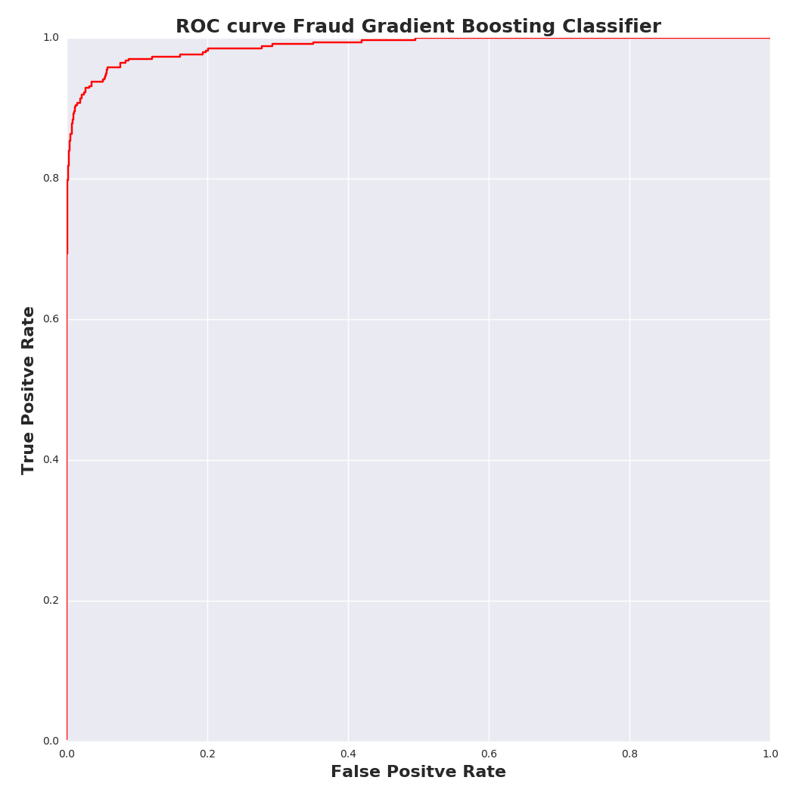
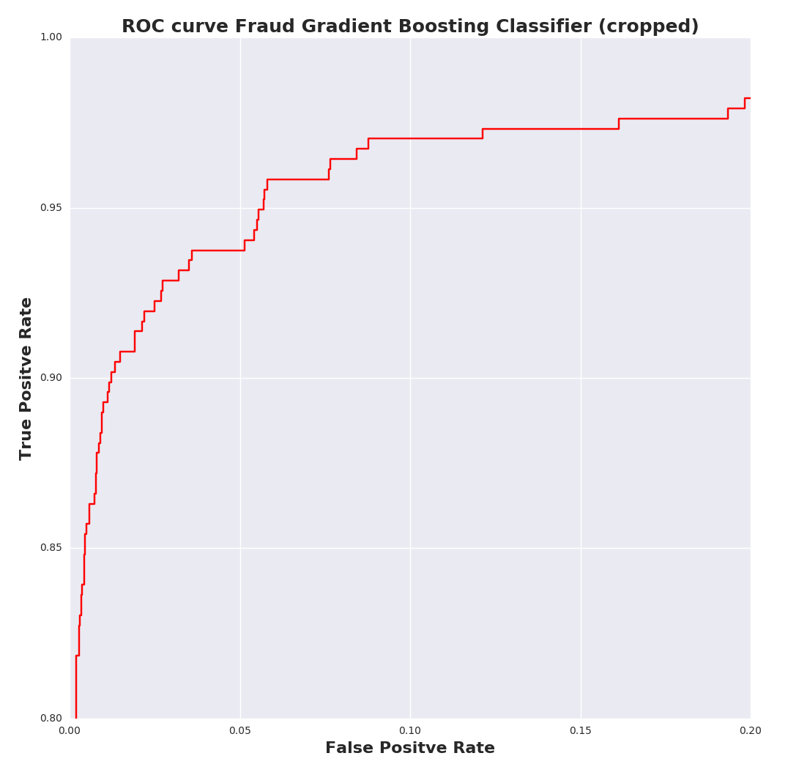

# Fraud Detection Case Study


##### Triage table for investigation of potential fraud. Contains redacted organization name, predicted probability of fraud, gross sales, and risk score (risk scoring function near bottom of this document).

| Triage Order | Redacted Name  | Probability of Fraud | Gross Sales | Risk Score |
|--------------|----------------|----------------------|-------------|------------|
| 1.           | Organization A | 0.893                | 356020      | 4.96       |
| 2.           | Organization B | 0.952                | 125690      | 4.85       |
| 3.           | Organization C | 0.789                | 256870      | 4.27       |
| 4.           | Organization D | 0.801                | 163205      | 4.18       |
| 5.           | Organization E | 0.693                | 568987      | 3.99       |
<br>

<h4> Figure 1: Fraud Detection Model ROC curve for gradient boosted classifier. </h4>
<br>
<br>

<h4> Figure 2: Fraud Detection Model ROC curve cropped for clarity. </h4>
<br>
<h4> Gradient Boosting Classifier Class that is pickled for reuse once fitted. </h4>

```python
import pandas as pd
import cPickle as pickle
from sklearn.preprocessing import StandardScaler
from sklearn.ensemble import GradientBoostingClassifier


class GBCModel(object):

    def __init__(self):

    def _make_df(self, json_data, d_type='train'):
        self.num_df = pd.read_json(json_data)
        # Is from country with high fraud propability
        self.num_df['is_susp_country'] = ((self.num_df['country'] == 'PH') |
                                          (self.num_df['country'] == 'A1') |
                                          (self.num_df['country'] == 'MA') |
                                          (self.num_df['country'] == 'VN') |
                                          (self.num_df['country'] == 'PK')).astype(int)
        # Does it have a header?
        self.num_df['header_resp'] = ((self.num_df['has_header'] == 1) |
                                      (self.num_df['has_header'] == 0)).astype(int)
        # Was it listed as having a header or not having a header?
        self.num_df['is_listed'] = (self.num_df['listed'] == 1).astype(int)
        # Drop columns that cannnot easily be made numeric
        self.num_df.drop(['country', 'currency', 'description', 'email_domain',
                          'name', 'org_desc', 'org_name', 'payee_name',
                          'previous_payouts', 'ticket_types', 'venue_address',
                          'venue_country', 'venue_name', 'venue_state'],
                          axis=1, inplace=True)
        # Make dummies for payout type and add to df
        self.num_df['ACH'] = (self.num_df['payout_type'] == 'ACH').astype(int)
        self.num_df['CHECK'] = (self.num_df['payout_type'] == 'CHECK').astype(int)
        self.num_df['BLANK'] = (self.num_df['payout_type'] == '').astype(int)
        if d_type == 'test':
            # Drop columns that are no longer needed and fill NaN's with zero
            self.num_df.drop(['listed', 'payout_type'], axis=1, inplace=True)
            self.num_df = self.num_df.fillna(value=0)
            return self.num_df
        else:
            # Create is_fraud (y) colmun
            self.num_df['is_fraud'] = ((self.num_df['acct_type'] == 'fraudster') |
                                       (self.num_df['acct_type'] == 'fraudster_event') |
                                       (self.num_df['acct_type'] == 'fraudster_att')).astype(int)
            # Drop columns that are no longer needed and fill NaN's with zero
            self.num_df.drop(['acct_type', 'listed', 'payout_type'], axis=1, inplace=True)
            self.num_df = self.num_df.fillna(value=0)
            return self.num_df

    def _make_train_Xy(self):
        # Make X and y from num_df
        self.y_train = self.num_df.pop('is_fraud')
        self.X_train = self.num_df
        # Scale X data
        self._scaler = StandardScaler()
        self.X_train = self._scaler.fit_transform(self.X_train)
        return self.X_train, self.y_train

    def _fit_GBC(self):
        # Create gradient boosting classifier and fit it to training data
        self._boosting = GradientBoostingClassifier(learning_rate=0.001, max_depth=6,
                                                    max_features=9, subsample=0.9,
                                                    loss='deviance', n_estimators=10000)
        self._boosting.fit(self.X_train, self.y_train)

    def fit(self, json_data):
        self.json_data = json_data
        # Process the trainging data and fit the GBC model
        self._make_df(self.json_data)
        self._make_train_Xy()
        self._fit_GBC()

    def _make_test_X(self):
        # Make X and scale X_test
        self.X_test = self.num_df
        self.X_test = self._scaler.transform(self.X_test)
        return self.X_test

    def predict(self, json_test):
        # Process the test data and get predicted probabilities from GBC model
        self._make_df(json_data=json_test, d_type='test')
        self._make_test_X()
        return self._boosting.predict_proba(self.X_test)


if __name__ == '__main__':
    model = GBCModel()
    model.fit('./data/data.json')
    # Save fitted model as pickle
    with open('model.pkl', 'w') as f:
        pickle.dump(model, f)

```

<h4> Risk-scoring algorithm that considers probability of fraud as well as log of gross sales. The model prioritizes investigation of cases with high risk and high potential cost. </h4>

```python
import numpy as np


def risk_score(proba, gross_sales):
   """
   Input: proba and gross_sales can be np arrays, pd series,
   floats, or ints of equal length
   Return: risk score (float)
   """
   log_gs = np.log10(gross_sales + 1)
   return proba * log_gs
  ```

<h4> Function for scoring models while grid-searching. </h4>

```python
from sklearn.metrics import confusion_matrix, log_loss


def grid_score(y, y_pred, y_pred_proba):
    # Scoring functions that returns False Prediction Rates and log loss
    mat = confusion_matrix(y, y_pred)
    FNR = float(mat[1][0]) / (mat[1][1] + mat[1][0])
    FPR = float(mat[0][1]) / (mat[0][0] + mat[0][1])
    lg_loss = log_loss(y, y_pred_proba)
    return FNR, FPR, lg_loss
```

    
